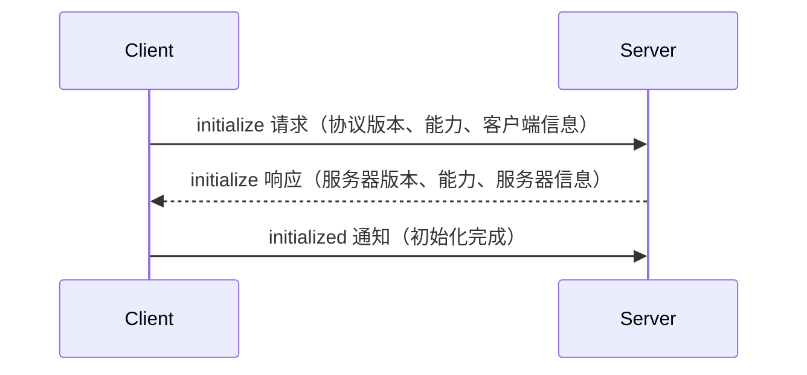

# MCP 服务器架构详解

## 一、整体架构

MCP（Model Context Protocol）基于 JSON-RPC 2.0 协议，采用**分层架构**设计：

```
┌─────────────────────────────────────────────────┐
│          客户端 (Claude Desktop 等)              │
└──────────────────┬──────────────────────────────┘
                   │ JSON-RPC 消息
                   ↓
┌─────────────────────────────────────────────────┐
│         MCP 服务器（我们正在实现）                │
├─────────────────────────────────────────────────┤
│  1. 消息解析层    ← 接收JSON-RPC消息              │
│  2. 协议处理层    ← 处理MCP特定的请求/通知         │
│  3. 工具注册层    ← 管理工具实例和调用             │
│  4. 资源管理层    ← 管理服务器资源                 │
└──────────────────┬──────────────────────────────┘
                   │
┌─────────────────────────────────────────────────┐
│        传输层 (WebSocket/HTTP/stdio)             │
└─────────────────────────────────────────────────┘
```

---

## 二、核心概念讲解

### 1. JSON-RPC 2.0 基础

MCP 建立在 JSON-RPC 2.0 之上。JSON-RPC 定义了**三种**消息类型：

```csharp
// 1. 请求 (Request) - 需要响应的消息
{
  "jsonrpc": "2.0",
  "id": 123,
  "method": "tools/list",
  "params": { ... }
}

// 2. 通知 (Notification) - 不需要响应的消息
{
  "jsonrpc": "2.0",
  "method": "notifications/initialized",
  "params": { ... }
}

// 3. 响应 (Response) - 回复请求的消息
{
  "jsonrpc": "2.0",
  "id": 123,
  "result": { ... }
}

// 4. 错误响应 (Error Response)
{
  "jsonrpc": "2.0",
  "id": 123,
  "error": {
    "code": -32603,
    "message": "Internal error"
  }
}
```

**要点**：
- 每条请求都有唯一的 `id`
- 通知不使用 `id` 字段
- `id` 将请求与响应配对

### 2. MCP 协议的生命周期

#### 阶段 1：初始化 (Initialization)



**代码对应**：
- `InitializeRequestParams` - 客户端发送
- `InitializeResult` - 服务器响应
- `NotificationMethods.InitializedNotification` - 客户端发送

**初始化关键要素**：
- `protocolVersion`: 协商协议版本（基于日期，如 "2024-11-05"）
- `capabilities`: 双方支持的功能（工具、资源、采样等）
- `clientInfo` / `serverInfo`: 实现版本信息

---

## 三、服务器分层架构

### 第一层：协议定义层 (Protocol)

**职责**：定义所有 MCP 消息的数据结构

**关键文件**：
- `RequestParams.cs` - 所有请求参数的基类
- `Result.cs` - 所有响应的基类
- `JsonRpcMessage.cs` - JSON-RPC 消息基类
- `CallToolRequestParams.cs` - 工具调用参数
- `CallToolResult.cs` - 工具调用结果

**设计思想**：
```csharp
// 使用继承体现消息类型关系
public abstract class RequestParams { }
public class CallToolRequestParams : RequestParams { }
public class ListToolsRequestParams : RequestParams { }

// 结果也有基类
public abstract class Result { }
public class CallToolResult : Result { }
public class ListToolsResult : Result { }
```

**为什么这样设计？**
- **类型安全**：每个请求/响应都有明确的类型
- **可扩展**：添加新消息类型只需继承基类
- **序列化统一**：所有消息都继承自相同基类，序列化规则一致

---

### 第二层：服务器基础设施层 (Server Infrastructure)

**职责**：提供服务器运行的基础能力

**关键组件**：

#### 1. `McpServer` (抽象类)

```csharp
public abstract class McpServer
{
    // 获取客户端能力
    public abstract ClientCapabilities ClientCapabilities { get; }
    
    // 获取客户端信息
    public abstract Implementation ClientInfo { get; }
    
    // 获取服务器选项
    public abstract McpServerOptions ServerOptions { get; }
    
    // 服务容器（用于依赖注入）
    public abstract IServiceProvider Services { get; }
    
    // 运行服务器（进入监听循环）
    public abstract Task RunAsync(CancellationToken cancellationToken = default);
}
```

**为什么是抽象类？**
- 实际的服务器需要选择传输方式（WebSocket/HTTP/stdio）
- 不同传输方式的实现细节不同

#### 2. `McpServerTool` (工具基类)

```csharp
public abstract class McpServerTool : IMcpServerPrimitive
{
    // 协议层面的工具定义
    public abstract Tool ProtocolTool { get; }
    
    // 工具元数据（用于反射、验证等）
    public abstract IReadOnlyList<object> Metadata { get; }
    
    // 调用工具的核心方法
    public abstract ValueTask<CallToolResult> InvokeAsync(
        RequestContext<CallToolRequestParams> request,
        CancellationToken cancellationToken = default);
}
```

**设计模式**：策略模式 + 模板方法模式
- 每个工具都是 `McpServerTool` 的具体实现
- `InvokeAsync` 定义了调用接口，具体逻辑由子类实现

#### 3. `RequestContext<TParams>` (请求上下文)

```csharp
public sealed class RequestContext<TParams>
{
    public TParams Params { get; set; }  // 请求参数
    public IDictionary<string, object> Items { get; set; }  // 运行时数据
}
```

**用途**：
- 封装每个请求的所有上下文信息
- 允许在处理过程中传递中间数据

---

### 第三层：工具注册与调用层 (Tool Management)

#### 工具的生命周期

```
1. 定义工具
   ↓
2. 注册到服务器
   ↓
3. 客户端请求工具列表
   ↓
4. 客户端调用工具
   ↓
5. 服务器查找工具
   ↓
6. 执行工具逻辑
   ↓
7. 返回结果
```

#### 工具创建方式

**方式 1：通过 Delegate 创建**
```csharp
var tool = McpServerTool.Create(
    (string message, CancellationToken ct) => {
        return "Echo: " + message;
    }
);
```

**方式 2：通过 MethodInfo 创建（反射）**
```csharp
public class WeatherService
{
    public async Task<CallToolResult> GetWeather(string city, CancellationToken ct)
    {
        // 获取天气逻辑
    }
}

var tool = McpServerTool.Create(
    typeof(WeatherService).GetMethod("GetWeather"),
    new WeatherService()
);
```

**方式 3：通过 Attribute 标记**
```csharp
public class MyTools
{
    [McpServerTool(Name = "echo", Description = "回显消息")]
    public string Echo(string message)
    {
        return message;
    }
}
```

---

## 四、关键数据流转

### 工具调用的完整流程

```csharp
// 1. 客户端发送调用请求
var request = new JsonRpcRequest
{
    Id = new RequestId("1"),
    Method = "tools/call",
    Params = new JObject
    {
        ["name"] = "echo",
        ["arguments"] = new JObject
        {
            ["message"] = "Hello World"
        }
    }
};

// 2. 服务器解析请求
var mcpRequest = new RequestContext<CallToolRequestParams>
{
    Params = new CallToolRequestParams
    {
        Name = "echo",
        Arguments = { ["message"] = "Hello World" }
    }
};

// 3. 查找工具
var tool = server.FindTool("echo");

// 4. 调用工具
var result = await tool.InvokeAsync(mcpRequest, cancellationToken);

// 5. 构建响应
var response = new JsonRpcResponse
{
    Id = request.Id,
    Result = JObject.FromObject(result)
};

// 6. 返回给客户端
await client.SendResponse(response);
```

---

## 五、我们的改造：Unity 适配

### 为什么需要改造？

**原始 SDK 依赖**：
- `System.Text.Json` - .NET 5.0+ 的特性
- `Microsoft.Extensions.AI` - 微软 AI 框架
- `System.Threading.Tasks.Channels` - 高级并发模型

**Unity 的限制**：
- 支持 .NET Standard 2.0（较老的 API）
- 无 `System.Text.Json`（除非单独集成）
- 更偏向简单、可控的实现

### 我们的改造策略

#### 1. 替换 JSON 序列化

```csharp
// 原始方案
using System.Text.Json;
var json = JsonSerializer.Serialize(obj);

// 改造方案
using Newtonsoft.Json;
var json = JsonConvert.SerializeObject(obj);
```

**优点**：
- Unity 完全支持 Newtonsoft.Json
- API 简单易用

**缺点**：
- 性能略低（通常可忽略）
- 文件较大

#### 2. 简化工具创建接口

```csharp
// 原始方案（使用反射 + Microsoft.Extensions.AI）
var tool = McpServerTool.Create(methodInfo, instance, options);

// 我们的方案
var tool = AIFunctionMcpServerTool.Create(method, options);
```

**损失**：
- ❌ 失去一些高级反射特性（如更复杂的依赖注入）
- ❌ 失去源生成性能优化

**获得**：
- ✅ 代码更简洁
- ✅ 兼容 Unity
- ✅ 更容易理解

#### 3. 参数绑定简化

**原始 SDK 支持**：
- 自动绑定 `CancellationToken`
- 自动绑定 `IServiceProvider`
- 自动绑定 `McpServer`
- 自动绑定 `IProgress<T>`
- 依赖注入参数解析

**我们保留**：
- ✅ 自动绑定 `CancellationToken`
- ✅ 自动绑定 `IServiceProvider`（如果有）
- ❌ 失去 `IProgress<T>` 自动绑定
- ❌ 失去复杂的依赖注入

**对应代码**：
```csharp
// AIFunctionMcpServerTool.cs 第 271-316 行
private static async Task<CallToolResult> InvokeMethodAsync(
    MethodInfo method, object target, JObject args, 
    CancellationToken ct, McpServerToolCreateOptions options)
{
    var parameters = method.GetParameters();
    object[] paramValues = new object[parameters.Length];
    
    for (int i = 0; i < parameters.Length; i++)
    {
        var param = parameters[i];
        
        // 特殊参数处理
        if (typeof(CancellationToken).IsAssignableFrom(param.ParameterType))
        {
            paramValues[i] = ct;
        }
        else if (typeof(IServiceProvider).IsAssignableFrom(param.ParameterType))
        {
            paramValues[i] = options?.Services;
        }
        else
        {
            // 从 args 获取参数值
            if (args[param.Name] != null)
            {
                paramValues[i] = args[param.Name].ToObject(param.ParameterType);
            }
        }
    }
    
    // 调用方法
    object result = method.Invoke(target, paramValues);
    
    // 处理异步返回值
    if (result is Task taskResult)
    {
        await taskResult;
    }
    
    return ConvertToCallToolResult(result);
}
```

---

## 六、缺失的部分

基于当前代码，我们需要实现：

1. **McpServer 的具体实现**
   - 目前只有抽象类
   - 需要实现 `RunAsync` 监听循环
   - 需要实现 JSON-RPC 消息路由

2. **JSON-RPC 消息处理器**
   - 解析 JSON-RPC 消息
   - 路由到对应的处理器
   - 构建响应

3. **工具注册表**
   - 存储所有工具
   - 提供查找接口

4. **初始化握手处理**
   - 处理 initialize 请求
   - 发送 initialize 响应
   - 处理 initialized 通知

---

## 七、学习要点

### 1. 为什么使用抽象类而不是接口？

```csharp
public abstract class McpServer
{
    public abstract Task RunAsync(CancellationToken cancellationToken);
}

// vs

public interface IMcpServer
{
    Task RunAsync(CancellationToken cancellationToken);
}
```

**原因**：
- 抽象类可以包含**实现代码**
- 可以定义**受保护的辅助方法**
- 子类可以**选择性重写**方法

### 2. 为什么使用 ValueTask？

```csharp
public abstract ValueTask<CallToolResult> InvokeAsync(...);
```

**原因**：
- `ValueTask` 比 `Task` **更轻量**（避免分配堆内存）
- 适合**高频调用**的场景（如工具调用）
- Unity 也支持 `ValueTask`

### 3. 为什么需要 RequestContext？

**原因**：
- 封装请求的所有上下文
- 允许传递**运行时数据**
- 统一处理日志、追踪等横切关注点

---

## 下一步

现在我们已经理解了架构，接下来我们要：
1. 实现具体的 McpServer 类
2. 实现 JSON-RPC 消息处理
3. 实现工具注册表
4. 创建完整示例

让我们继续！

